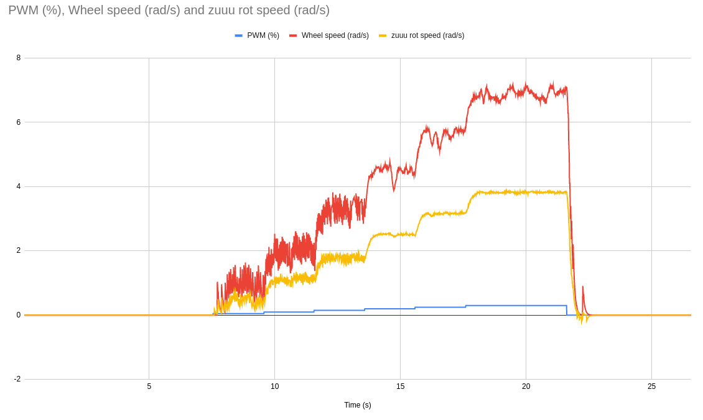
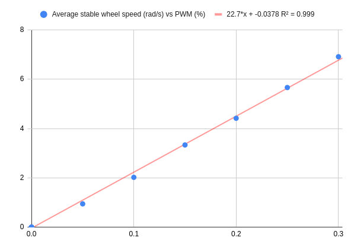

## Basic model
The most basic linear model between PWM (between 0 and 1) and wheel rotation speed (rad/s) yields (based on measures, not on the model):
```
22.7 * PWM = wheel_rot_speed
```



Some quick measures done using this model on the robot:
- 10 full rotations measured in 31.3 sec, asking for a rotational speed of 2 rad/s PID mode. Good result (31.3 * 2 / (2*pi)) = 9.96.
- 10 full rotations measured in 31.41 sec, asking for a rotational speed of 2 rad/s OPEN_LOOP mode. Good result (31.3 * 2 / (2*pi)) = 10.00
- Using the set_speed service in OPEN_LOOP mode, asking for a rot speed of 2 rad/s for a duration of 31.4s gave an error of ~~30° (of excess after 10 full rotations). 

## A slighlty better model
Taking out the point in 0,0, we have a rough estimate of the PWM needed to beat the static friction (the axis have been inverted):


The model then becomes:

```
If the PWM is between -0.0126 and +0.0126, then the wheel speed is 0. Otherwise:
0.0418 * wheel_rot_speed + 0.0126 = PWM 
(PWM - 0.0126)/0.0418 = wheel_rot_speed
```